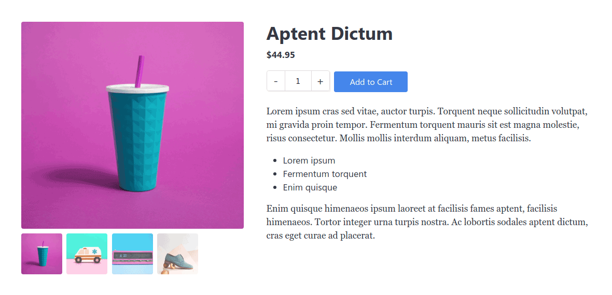
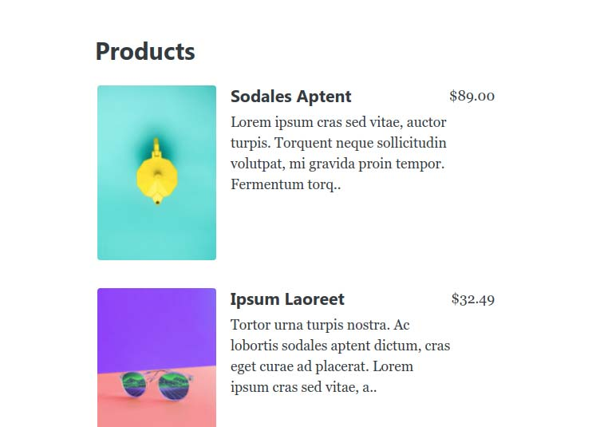
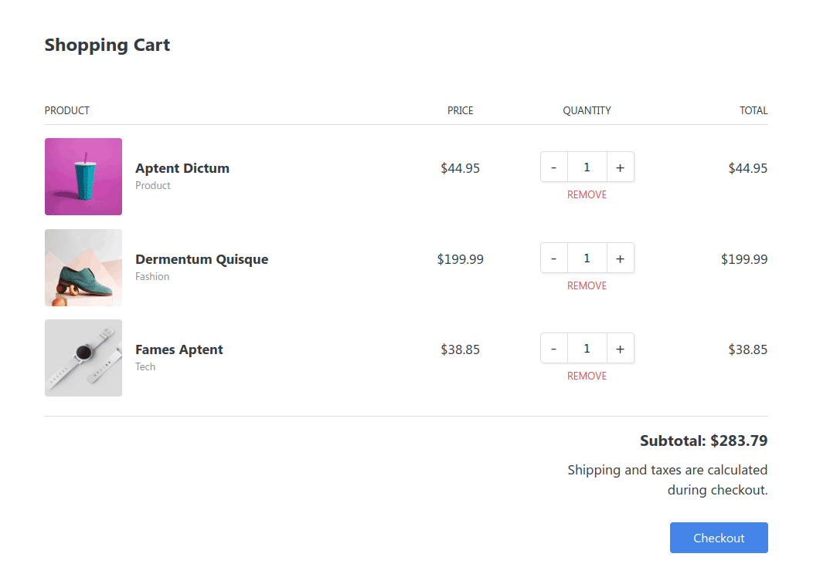
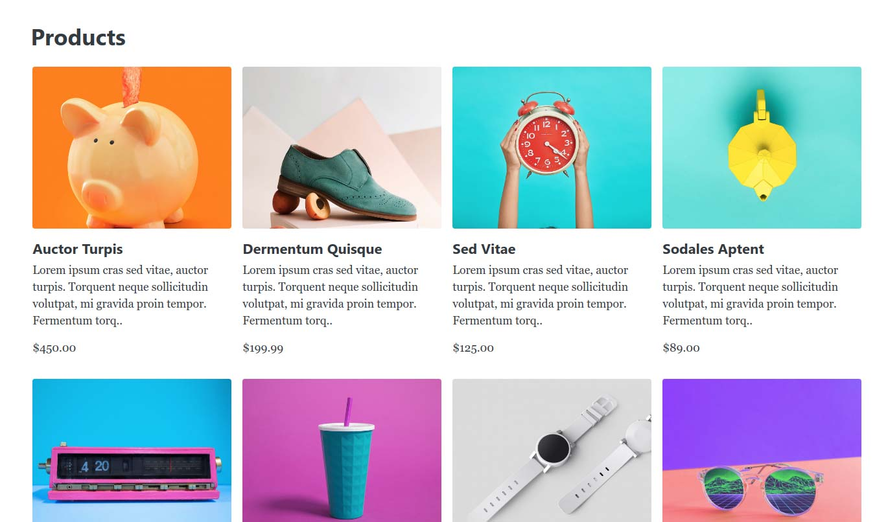

# Reflow Examples

This repo contains a few examples which demonstrate what is possible with the [Reflow Ecommerce Toolkit](https://reflowhq.com). Browse this repo's directories to see the source code.

## Product Page

Demonstrates how the [Product](https://reflowhq.com/docs/product.html) component renders a page, complete with a media gallery and add to cart button.

[Demo](https://reflow-hq.github.io/examples/v2/product-full/index.html) | [Source Code](./v2/product-full)

## Product List

This example which shows a straightforward use of the [Product List](https://reflowhq.com/docs/product-list.html) component.

[Demo](https://reflow-hq.github.io/examples/v2/products-list/index.html) | [Source Code](./v2/products-list)

## Shopping Cart

Shows how easy it is to combine a [Shopping Cart](https://reflowhq.com/docs/shopping-cart.html) and [Add to Cart](https://reflowhq.com/docs/add-to-cart.html) buttons.

[Demo](https://reflow-hq.github.io/examples/v2/cart/index.html) | [Source Code](./v2/cart)

## Dynamic Product

Demonstrates a full online store, by combining a Shopping Cart, Product List and Product. More info is available in the `products-dynamic` folder.

[Demo](https://reflow-hq.github.io/examples/v2/products-dynamic/index.html) | [Source Code](./v2/products-dynamic)